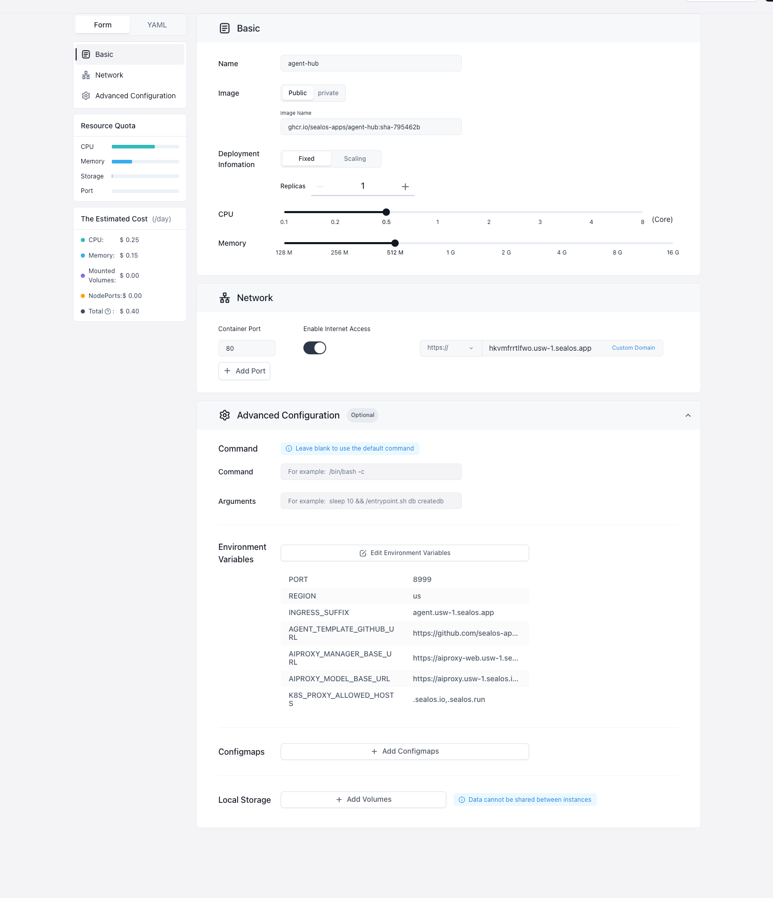

# Agent Hub US / CN 上线填写说明

本文用于在 Sealos App Launchpad 表单里上线 Agent Hub。Agent Hub 是一个镜像，里面已经包含 Web 页面和后端 API，不需要拆成两个服务。

## 参考截图



## 1. 镜像

镜像来自 GHCR：

```text
ghcr.io/sealos-apps/agent-hub:sha-<短 SHA>
```

当前已构建成功的 main 镜像：

```text
ghcr.io/sealos-apps/agent-hub:sha-795462b
```

生产不要填 `latest`。

## 2. 名称

| 表单项 | 建议值 |
| --- | --- |
| Name | `agent-hub` 或 `agenthub-<后缀>` |

线上已有实例示例：

```text
agenthub-fxeji0zb
```

## 3. 配置

| 表单项 | 建议值 |
| --- | --- |
| Deployment Information | `Fixed` |
| Replicas | `1` |
| CPU | `0.5 Core` 起步 |
| Memory | `512 Mi` 起步 |
| Command | 留空 |
| Arguments | 留空 |
| Configmaps | 不需要 |
| Local Storage | 不需要 |

## 4. 端口

| 表单项 | 值 |
| --- | --- |
| Container Port | `8999` |
| Enable Internet Access | 开启 |
| Public URL | 使用 Sealos 自动生成域名即可 |

`Container Port` 必须和环境变量 `PORT` 一致。当前线上用 `8999`，镜像默认值是 `8888`。

健康检查：

```bash
curl -fsS https://<APP_HOST>/healthz
curl -fsS https://<APP_HOST>/readyz
```

## 5. 环境变量

模板仓库地址使用 `AGENT_TEMPLATE_GITHUB_URL`：

```text
https://github.com/sealos-apps/Agent-Hub-Template
```

`INGRESS_SUFFIX` 用来拼接 Agent Hub 创建的新 Agent 访问域名，不是 Agent Hub Console 自己的 Public URL。

US：

| Key | Value |
| --- | --- |
| `PORT` | `8999` |
| `REGION` | `us` |
| `INGRESS_SUFFIX` | `agent.usw-1.sealos.app` |
| `SSH_DOMAIN` | `ssh.usw-1.sealos.app` |
| `AGENT_TEMPLATE_GITHUB_URL` | `https://github.com/sealos-apps/Agent-Hub-Template` |
| `AIPROXY_MANAGER_BASE_URL` | `https://aiproxy-web.usw-1.sealos.io` |
| `AIPROXY_MODEL_BASE_URL` | `https://aiproxy.usw-1.sealos.io/v1` |
| `K8S_PROXY_ALLOWED_HOSTS` | `.sealos.io,.sealos.run` |

USW 可选 AIProxy 地址：

| 集群 | `AIPROXY_MANAGER_BASE_URL` | `AIPROXY_MODEL_BASE_URL` |
| --- | --- | --- |
| `usw` | `https://aiproxy-web.usw.sealos.io` | `https://aiproxy.usw.sealos.io/v1` |
| `usw-1` | `https://aiproxy-web.usw-1.sealos.io` | `https://aiproxy.usw-1.sealos.io/v1` |

USW 可选入口域名：

| 集群 | `INGRESS_SUFFIX` | `SSH_DOMAIN` |
| --- | --- | --- |
| `usw` | `agent.usw.sealos.io` | `ssh.usw.sealos.io` |
| `usw-1` | `agent.usw-1.sealos.app` | `ssh.usw-1.sealos.app` |

CN：

| Key | Value |
| --- | --- |
| `PORT` | `8999` |
| `REGION` | `cn` |
| `INGRESS_SUFFIX` | `agent.hzh.sealos.run` |
| `SSH_DOMAIN` | `ssh.hzh.sealos.run` |
| `AGENT_TEMPLATE_GITHUB_URL` | `https://github.com/sealos-apps/Agent-Hub-Template` |
| `AIPROXY_MANAGER_BASE_URL` | `https://aiproxy-web.hzh.sealos.run` |
| `AIPROXY_MODEL_BASE_URL` | `https://aiproxy.hzh.sealos.run/v1` |
| `K8S_PROXY_ALLOWED_HOSTS` | `.sealos.io,.sealos.run` |

CN 可选 AIProxy 地址：

| 集群 | `AIPROXY_MANAGER_BASE_URL` | `AIPROXY_MODEL_BASE_URL` |
| --- | --- | --- |
| `hzh` | `https://aiproxy-web.hzh.sealos.run` | `https://aiproxy.hzh.sealos.run/v1` |
| `bja` | `https://aiproxy-web.bja.sealos.run` | `https://aiproxy.bja.sealos.run/v1` |
| `gzg` | `https://aiproxy-web.gzg.sealos.run` | `https://aiproxy.gzg.sealos.run/v1` |

CN 可选入口域名：

| 集群 | `INGRESS_SUFFIX` | `SSH_DOMAIN` |
| --- | --- | --- |
| `hzh` | `agent.hzh.sealos.run` | `ssh.hzh.sealos.run` |
| `bja` | `agent.bja.sealos.run` | `ssh.bja.sealos.run` |
| `gzg` | `agent.gzg.sealos.run` | `ssh.gzg.sealos.run` |

注意：`REGION` 只能填 `us` 或 `cn`，不要填 `usw-1` 或 `hzh`。

可选项：如果 WebSocket 需要跨域访问，再配置 `WS_ALLOWED_ORIGINS`，多个 Origin 用英文逗号分隔；同域访问不需要填。

## 6. App 资源

Launchpad 表单只负责 Web/API 服务。桌面入口还需要注册 2 个 Sealos App 资源：

| App | displayType | 作用 |
| --- | --- | --- |
| `agenthub` | `normal` | Sealos 桌面主入口 |
| `agenthub-console` | `hidden` | Console 窗口入口 |

直接注册以下 YAML。把 `<AGENT_HUB_URL>` 替换成 Launchpad 生成的 Public URL，例如 `https://agenthub-fxeji0zb.usw-1.sealos.app`。

主入口：

```yaml
apiVersion: app.sealos.io/v1
kind: App
metadata:
  name: agenthub
  namespace: app-system
spec:
  data:
    desc: Agent Hub Workspace
    url: "<AGENT_HUB_URL>"
  icon: "<AGENT_HUB_URL>/brand/agent-hub.svg"
  i18n:
    zh:
      name: Agent Hub
    zh-Hans:
      name: Agent Hub
  menuData:
  name: Agent Hub
  type: iframe
  displayType: normal
```

Console 窗口入口：

```yaml
apiVersion: app.sealos.io/v1
kind: App
metadata:
  name: agenthub-console
  namespace: app-system
spec:
  data:
    desc: Agent Hub Console Window
    url: "<AGENT_HUB_URL>"
  icon: "<AGENT_HUB_URL>/brand/agenthub-console.svg"
  i18n:
    zh:
      name: Agent Hub 控制台
    zh-Hans:
      name: Agent Hub 控制台
  menuData:
  name: Agent Hub Console
  type: iframe
  displayType: hidden
```

对应仓库模板：

```text
deploy/manifests/agenthub-app.yaml.tmpl
deploy/manifests/agenthub-console-app.yaml.tmpl
```

`agenthub-console` 必须注册，否则前端无法通过 `openDesktopApp` 打开 Console 窗口。

## 7. K8s YAML 直接部署

Launchpad 填表方式需要保留；如果要直接走 Kubernetes，可以用下面这份 YAML。替换其中的占位符：

| 占位符 | 说明 |
| --- | --- |
| `<NAMESPACE>` | 部署到的用户 namespace |
| `<APP_NAME>` | 应用名，例如 `agenthub-fxeji0zb` |
| `<APP_HOST>` | Agent Hub 自己的访问域名，例如 `agenthub-fxeji0zb.usw-1.sealos.app` |
| `<IMAGE>` | 镜像，例如 `ghcr.io/sealos-apps/agent-hub:sha-795462b` |

USW-1 示例：

```yaml
apiVersion: apps/v1
kind: Deployment
metadata:
  name: <APP_NAME>
  namespace: <NAMESPACE>
  labels:
    app: <APP_NAME>
    cloud.sealos.io/app-deploy-manager: <APP_NAME>
spec:
  replicas: 1
  revisionHistoryLimit: 1
  selector:
    matchLabels:
      app: <APP_NAME>
  template:
    metadata:
      labels:
        app: <APP_NAME>
    spec:
      automountServiceAccountToken: false
      securityContext:
        runAsNonRoot: true
        seccompProfile:
          type: RuntimeDefault
      containers:
        - name: <APP_NAME>
          image: <IMAGE>
          imagePullPolicy: IfNotPresent
          ports:
            - name: http
              containerPort: 8999
          env:
            - name: PORT
              value: "8999"
            - name: REGION
              value: us
            - name: INGRESS_SUFFIX
              value: agent.usw-1.sealos.app
            - name: SSH_DOMAIN
              value: ssh.usw-1.sealos.app
            - name: AGENT_TEMPLATE_GITHUB_URL
              value: https://github.com/sealos-apps/Agent-Hub-Template
            - name: AIPROXY_MANAGER_BASE_URL
              value: https://aiproxy-web.usw-1.sealos.io
            - name: AIPROXY_MODEL_BASE_URL
              value: https://aiproxy.usw-1.sealos.io/v1
            - name: K8S_PROXY_ALLOWED_HOSTS
              value: .sealos.io,.sealos.run
          resources:
            requests:
              cpu: 100m
              memory: 256Mi
            limits:
              cpu: "1"
              memory: 1Gi
          securityContext:
            allowPrivilegeEscalation: false
            capabilities:
              drop:
                - ALL
          startupProbe:
            httpGet:
              path: /healthz
              port: http
            periodSeconds: 5
            failureThreshold: 24
          readinessProbe:
            httpGet:
              path: /readyz
              port: http
            periodSeconds: 10
            failureThreshold: 3
          livenessProbe:
            httpGet:
              path: /healthz
              port: http
            periodSeconds: 10
            failureThreshold: 3
---
apiVersion: v1
kind: Service
metadata:
  name: <APP_NAME>
  namespace: <NAMESPACE>
  labels:
    app: <APP_NAME>
    cloud.sealos.io/app-deploy-manager: <APP_NAME>
spec:
  selector:
    app: <APP_NAME>
  ports:
    - name: http
      port: 8999
      targetPort: http
---
apiVersion: networking.k8s.io/v1
kind: Ingress
metadata:
  name: <APP_NAME>
  namespace: <NAMESPACE>
  labels:
    cloud.sealos.io/app-deploy-manager: <APP_NAME>
    cloud.sealos.io/app-deploy-manager-domain: <APP_NAME>
  annotations:
    kubernetes.io/ingress.class: nginx
    nginx.ingress.kubernetes.io/backend-protocol: HTTP
    nginx.ingress.kubernetes.io/client-body-buffer-size: 64k
    nginx.ingress.kubernetes.io/proxy-body-size: 32m
    nginx.ingress.kubernetes.io/proxy-buffer-size: 64k
    nginx.ingress.kubernetes.io/proxy-read-timeout: "300"
    nginx.ingress.kubernetes.io/proxy-send-timeout: "300"
    nginx.ingress.kubernetes.io/server-snippet: |
      client_header_buffer_size 64k;
      large_client_header_buffers 4 128k;
    nginx.ingress.kubernetes.io/ssl-redirect: "true"
spec:
  rules:
    - host: <APP_HOST>
      http:
        paths:
          - path: /
            pathType: Prefix
            backend:
              service:
                name: <APP_NAME>
                port:
                  number: 8999
  tls:
    - hosts:
        - <APP_HOST>
      secretName: wildcard-cert
```

CN 部署时只改 5 个值：

| Key | USW-1 | CN hzh 示例 |
| --- | --- | --- |
| `REGION` | `us` | `cn` |
| `INGRESS_SUFFIX` | `agent.usw-1.sealos.app` | `agent.hzh.sealos.run` |
| `SSH_DOMAIN` | `ssh.usw-1.sealos.app` | `ssh.hzh.sealos.run` |
| `AIPROXY_MANAGER_BASE_URL` | `https://aiproxy-web.usw-1.sealos.io` | `https://aiproxy-web.hzh.sealos.run` |
| `AIPROXY_MODEL_BASE_URL` | `https://aiproxy.usw-1.sealos.io/v1` | `https://aiproxy.hzh.sealos.run/v1` |

## 8. Helm Chart 部署

Helm Chart 放在：

```text
deploy/charts/agent-hub
```

USW-1：

```bash
helm upgrade --install agenthub deploy/charts/agent-hub \
  -n <NAMESPACE> \
  --set fullnameOverride=<APP_NAME> \
  --set image.tag=sha-795462b \
  --set ingress.host=<APP_HOST>
```

CN hzh：

```bash
helm upgrade --install agenthub deploy/charts/agent-hub \
  -n <NAMESPACE> \
  -f deploy/charts/agent-hub/values-cn.yaml \
  --set fullnameOverride=<APP_NAME> \
  --set image.tag=sha-795462b \
  --set ingress.host=<APP_HOST>
```

占位符和上面的 K8s YAML 一致：

| 占位符 | 示例 |
| --- | --- |
| `<NAMESPACE>` | `ns-fxeji0zb` |
| `<APP_NAME>` | `agenthub-fxeji0zb` |
| `<APP_HOST>` | `agenthub-fxeji0zb.usw-1.sealos.app` |

渲染检查：

```bash
helm template agenthub deploy/charts/agent-hub \
  -n <NAMESPACE> \
  --set fullnameOverride=<APP_NAME> \
  --set ingress.host=<APP_HOST>
```
