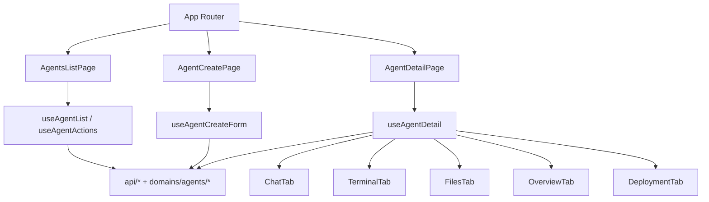

# 技术设计: Agent Hub 对齐 DevBox 产品风格重构

## 技术方案

### 核心技术
- 前端框架: React 19 + Vite
- 路由: 新增 `react-router-dom`
- 样式: Tailwind CSS 4，收敛到与 DevBox 接近的页面间距、圆角、阴影、按钮和状态标签
- 现有业务复用: `web/src/api/*`、`web/src/domains/agents/*`、`useAgentChat`、`useAgentTerminal`、`useAgentFiles`
- 参考源码基线: `reference/sealos/frontend/providers/devbox`

### 实现要点
- 保持当前 Vite 技术栈，不迁移到 Next.js；通过引入路由实现 DevBox 同类的信息架构。
- 将当前单页面 Agent Hub 拆为列表页、创建页、详情页。
- 列表页对齐 DevBox 首页结构，但列表列内容保留 Agent 业务重点。
- 创建页由现有 `AgentTemplatePickerModal + AgentConfigModal` 迁移为完整页面流程。
- 详情页以左侧 tab + 右侧内容区承载聊天、终端、文件和部署信息。
- 现有聊天、终端、文件协议 hook 先复用，只迁移视图挂载和状态组织方式。

## 架构设计


## 架构决策 ADR

### ADR-20260416-01: 保持 Vite，新增前端路由而不是迁移到 Next
**上下文:** DevBox 使用 Next App Router，Agent Hub 当前为 Vite 单页面。为了与 DevBox 做几乎一致的产品结构，需要页面分层，但整仓迁移到 Next 成本过高且与当前后端联调无直接收益。  
**决策:** 保持 Vite + React 19 现状，引入 `react-router-dom` 构建“列表页 / 创建页 / 详情页”结构。  
**理由:** 低成本获得产品结构升级，同时最大程度复用现有 API 与运行方式。  
**替代方案:** 整体迁移到 Next → 拒绝原因: 成本过高，偏离当前核心目标。  
**影响:** 前端入口、页面组织和导航方式将调整，但不会影响后端 API 设计。

### ADR-20260416-02: 复用现有业务 hook，优先迁移页面挂载方式
**上下文:** 当前 `useAgentChat`、`useAgentTerminal`、`useAgentFiles` 已完成较多协议对接，但都依赖首页页面态和 Modal。  
**决策:** 第一阶段不重写底层协议，只调整页面挂载位置和上层状态编排。  
**理由:** 降低回归风险，让重构聚焦在页面架构与 UI 风格统一。  
**替代方案:** 同时重写通信 hook → 拒绝原因: 变更面过大，难以保证稳定性。  
**影响:** 详情页会成为主要交互入口，原有 Modal 逐步退居辅助或被移除。

### ADR-20260416-03: 视觉对齐 DevBox，但不复制其基础设施信息架构
**上下文:** 用户要求与 DevBox 几乎一样的风格，但 Agent Hub 与 DevBox 的业务重点不同。  
**决策:** 统一页面骨架、Header、列表、详情页布局、按钮和状态标签风格；同时保留 Agent Hub 的业务信息优先级。  
**理由:** 保证同一产品线的一致感知，同时避免 Agent Hub 变成 DevBox 的资源控制台复制品。  
**替代方案:** 完全照抄 DevBox 列表与详情字段 → 拒绝原因: 业务焦点偏差，首页会重新变得过于运维化。  
**影响:** UI 上接近 DevBox，但首页和详情页的内容组织将围绕 Agent 能力设计。

## API设计

### GET /api/v1/agents
- **请求:** 保持现有请求头和集群上下文方式不变。
- **响应:** 继续返回 `agentName/templateId/aliasName/status/ready/bootstrapPhase/bootstrapMessage` 等字段。
- **前端用途:** 列表页、详情页概览、创建后跳转时的状态回填。

### GET /api/v1/agents/:agentName
- **请求:** 保持现有设计。
- **响应:** 详情页初始化数据的首选来源。
- **前端用途:** 详情页 Overview 和 Deployment 区域。

### Chat / Files / Terminal 相关接口
- **请求:** 保持当前实现。
- **响应:** 保持当前实现。
- **前端用途:** 从首页弹窗迁移到详情页 tab 内容区。

## 数据模型
```text
前端页面视图模型新增拆分:

AgentListViewModel
- id
- name
- aliasName
- status
- ready
- bootstrapMessage
- template
- resourceSpec
- actionAvailability

AgentDetailViewModel
- summary
- runtime
- modelConfig
- ingressStatus
- tabs

AgentCreateFormState
- templateId
- aliasName
- cpu
- memory
- storage
- model
- aiProxyTokenState
```

## 安全与性能
- **安全:** 继续遵守“AIProxy Key 不在主界面回显”的策略；仅在后端自动注入链路中使用。
- **安全:** 聊天、终端、文件管理沿用现有授权链路，不在本次重构中弱化校验。
- **性能:** 列表页继续仅在需要时轮询；详情页只加载当前 tab 所需重能力模块。
- **性能:** 对列表列组件进行细拆，减少不必要重渲染；列表轮询与详情轮询解耦。

## 测试与部署
- **测试:** 增加路由级手工验证清单，覆盖列表页、创建页、详情页、聊天、终端、文件、状态刷新。
- **测试:** 创建实例后重点验证“creating -> running -> ready”状态链路，不再仅通过首页视觉判断。
- **部署:** 前端重构不需要后端 API 变更即可分阶段上线；如需要补充详情接口字段，可在后续小步补齐。
