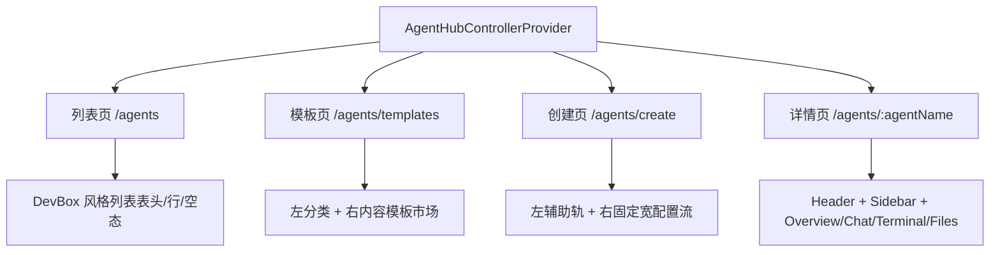

# 技术设计: Agent Hub DevBox 全量 UI 对齐重构

## 技术方案

### 核心技术
- React Router 页面结构
- 现有 Agent Hub 共享 controller 与业务 hooks
- Tailwind v4 utilities + 本地基础 UI 组件
- DevBox 源码参考：列表页 / 模板页 / 创建页 / 详情页 / 控制 API

### 实现要点
- 抽出一组 Agent Hub 内部共用的 DevBox 风格类名，统一边框、圆角、阴影、固定宽与头部节奏。
- 列表页按 DevBox 首页重排为 `Header + message + list/empty`，去掉不必要的“总览卡片”表达。
- 模板页引入左侧分类 + 右侧内容区布局，让模板选择页具备 DevBox 模板中心的骨架和卡片语法。
- 创建页采用 `Header + 左侧辅助栏 + 右侧固定宽表单流`，收敛说明性文案，增强运行时卡与资源/模型块的稳定宽度。
- 详情页采用 `Header + Sidebar + Content` 的 DevBox 工作台骨架，Overview 内拆为多个职责明确的卡片区块。
- 保持聊天、终端、文件 hooks 不重写，只调整挂载入口与页面承载方式。

## 架构设计

## 架构决策 ADR

### ADR-20260418-01: 以 DevBox 的页面语法为准，而不是继续保留当前 Agent Hub 的混合风格
**上下文:** 当前页面已经做过一轮对齐，但仍保留了大量非 DevBox 的结构和信息表达，用户明确认为“设计规范完全不对”。  
**决策:** 以 `reference/sealos/frontend/providers/devbox/` 的真实页面骨架为主，对 Agent Hub 页面组织进行整页重排。  
**理由:** 用户需求是“完完全全用一样的风格去实现”，继续做局部修补不会解决结构层面的偏差。  
**替代方案:** 仅微调颜色、圆角和间距 → 拒绝原因: 只能得到“看起来像”，而不是“用起来像”。  
**影响:** 需要调整多个页面、共享样式与业务组件，但能显著降低后续维护中的风格漂移。

### ADR-20260418-02: 保留现有业务 hooks 和后端接口，不在本次重构中推倒通信层
**上下文:** 聊天、终端、文件、创建、暂停/启动都已有可用链路；本次核心问题在页面设计规范和工作流组织。  
**决策:** 复用现有 controller、hooks 和 `/api/v1/agents*` 接口，只调整页面承载、信息布局与文案。  
**理由:** 避免把 UI 对齐任务扩散为协议层重写，控制风险并确保一次性完成。  
**替代方案:** 同时重写 detail data model 与所有页面交互链路 → 拒绝原因: 风险高、回归面过大，不符合本次主要矛盾。  
**影响:** 少数字段仍受当前 `AgentListItem` 模型限制，但可以先完成产品风格和主工作流的正确对齐。

## API设计

### `GET /api/v1/agents`
- **用途:** 列表页的实例控制面数据来源
- **前端承接:** 状态标签、ready/creating 轮询、资源规格、更新时间、快捷操作启用状态

### `GET /api/v1/agents/:agentName`
- **用途:** 详情页独立拉取和桌面终端窗口兜底读取
- **前端承接:** 实例名称、状态、资源、模型接入、bootstrap 信息

### `POST /api/v1/agents/:agentName/run`
- **用途:** 启动已暂停实例
- **前端承接:** Header 操作按钮、列表行操作按钮

### `POST /api/v1/agents/:agentName/pause`
- **用途:** 暂停运行实例
- **前端承接:** Header 操作按钮、列表行操作按钮

## 数据模型
- 继续使用 `AgentListItem` 作为前端核心视图模型。
- 本次不新增持久化结构，主要新增若干页面级派生视图块：
  - 列表页 header column config
  - 模板页 category groups
  - 详情页 overview sections

## 安全与性能
- **安全:** 不新增敏感信息展示；继续通过后端确保 AIProxy token 注入；前端仅展示是否已准备好。
- **性能:** 继续使用 controller 中的静默刷新与签名比较；大页面重排不改变现有轮询节奏。

## 测试与部署
- **测试:** 运行 `cd web && npm run build`，确认重构后页面可正常构建。
- **部署:** 本次只调整前端与知识库，不额外改变 Sealos 部署流程。
