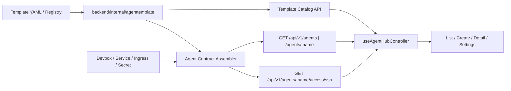

# 技术设计: Agent Hub 通用能力契约 v1 与 DevBox 接入平面对齐

## 技术方案

### 核心技术

- 前端：React 19、TypeScript、Vite、React Router、Tailwind CSS
- 后端：Go、Gin、client-go、Kubernetes Devbox CR
- 模板元数据：`template/<template-id>/template.yaml`
- 参考实现：`reference/sealos/frontend/providers/devbox/`

### 实现要点

- 后端成为模板目录与实例能力契约的唯一权威来源。
- 前端不再通过 `image / model / domain` 推断模板与能力。
- 模板目录显式声明：
  - `access`
  - `runtime`
  - `settings`
  - `actions`
  - `region-model-presets`
- 实例详情由“固定页面字段”改为“固定骨架 + 合同驱动的动态区块”。
- 设置更新拆成两条显式链路：
  - `runtime update`
  - `agent settings update`
- `SSH / IDE / Web UI` 全部纳入访问平面，而不是额外散落在页面特判里。

## 架构设计



### Contract V1 结构

后端与前端统一使用同一份语义结构：

```ts
type AgentContract = {
  core: {
    name: string
    aliasName: string
    templateId: string
    templateName: string
    namespace: string
    status: 'running' | 'creating' | 'stopped' | 'error'
    statusText: string
    ready: boolean
    bootstrapPhase: string
    bootstrapMessage: string
    createdAt: string
  }
  access: {
    items: Array<
      | { key: 'api'; enabled: boolean; url: string; auth: 'apiKey'; status: 'ready' | 'pending' }
      | { key: 'terminal'; enabled: boolean }
      | { key: 'files'; enabled: boolean; rootPath: string }
      | { key: 'ssh'; enabled: boolean; host: string; port: number; user: string; workingDir: string }
      | { key: 'ide'; enabled: boolean; modes: Array<'cursor' | 'vscode' | 'zed' | 'gateway'> }
      | { key: 'web-ui'; enabled: boolean; url: string; title: string }
    >
  }
  runtime: {
    cpu: string
    memory: string
    storage: string
    runtimeClassName: string
    workingDir: string
    networkType: string
  }
  settings: {
    runtime: AgentSettingField[]
    agent: AgentSettingField[]
  }
  actions: Array<'run' | 'pause' | 'delete' | 'open-terminal' | 'open-files' | 'open-settings' | 'open-chat'>
}
```

### 单一路径约束

本次方案明确禁止以下逻辑继续存在：

- 禁止通过镜像推断模板：
  - 删除 `inferTemplateIdFromImage`
- 禁止通过模型名临时推断 provider：
  - 不再使用 `resolveAIProxyProviderProfile('', model)` 作为运行态兜底
- 禁止通过 ingress/domain 推断 API 能力：
  - API 是否存在只看模板显式声明 + 后端计算结果
- 禁止 region 缺失时静默回落到 `us`
  - `REGION` 缺失应直接报错，阻止创建页错误展示模型列表
- 禁止列表模型和详情模型长期并存两套能力语义
  - 统一收敛到 `Agent Contract v1`

## 架构决策 ADR

### ADR-20260418-02: 后端负责实例能力契约装配
**上下文:** 当前模板信息在前端，实例信息在后端，能力又在页面里拼接，导致语义分裂。  
**决策:** 由后端基于 `template.yaml + Devbox/Service/Ingress/Secret` 装配 `Agent Contract v1`，前端只消费。  
**理由:** 模板能力、运行态资源、secret 都在后端更可控，且能避免前端推断。  
**替代方案:** 继续让前端拼装实例能力。  
**影响:** 需要改 DTO、模板目录、controller 和详情页渲染方式。

### ADR-20260418-03: 模板目录显式声明能力，不做推断
**上下文:** 当前仍有 `supportsAPIAccess`、`inferTemplateIdFromImage`、`map model -> provider` 等推断路径。  
**决策:** 模板目录显式声明 `access / settings / actions / model presets`，实例只引用模板 ID。  
**理由:** 这符合用户“只要一个方式、不要兜底”的要求。  
**替代方案:** 保留旧推断逻辑作为兼容层。 → 拒绝原因: 会让页面再次绕过契约。  
**影响:** 创建页和详情页的入口来源全部变更。

### ADR-20260418-04: 设置拆分为 runtime 与 agent settings
**上下文:** 当前单一 `PATCH /agents/:agentName` 语义过宽，后续模板私有配置会继续膨胀。  
**决策:** 拆成两个显式设置面和两个显式更新接口。  
**理由:** 更适合多模板体系，也更符合 DevBox 的“运行时一等公民”结构。  
**替代方案:** 继续往现有 update payload 里塞字段。 → 拒绝原因: 接口语义会持续恶化。  
**影响:** 需要修改前端设置页和后端校验逻辑。

### ADR-20260418-05: SSH / IDE 先做最小可用闭环
**上下文:** DevBox 的 IDE 入口依赖 `sshPort + privateKey + token + user + workingDir`，Agent Hub 当前没有对应接口。  
**决策:** 第一阶段先实现：
- SSH 信息接口
- 复制 SSH 命令
- 下载私钥
- 生成 Cursor / VSCode / Zed / Gateway deeplink  
**理由:** 这是复刻 DevBox IDE 接入能力的最短路径，且与模板 `SSHGate` 机制一致。  
**替代方案:** 一次性完整搬运 DevBox 所有 IDE drawer。 → 拒绝原因: 范围过大，且 Agent Hub 当前未建立对应状态层。  
**影响:** 先完成访问平面能力闭环，再迭代更多 IDE UI。

## API设计

### 1. 模板目录接口

#### [GET] `/api/v1/templates`
- **请求:** 无
- **响应:** 返回模板清单，包含：
  - `id`
  - `name`
  - `description`
  - `backendSupported`
  - `access`
  - `settings`
  - `actions`
  - `regionModelPresets`
  - `presentation`（logoKey、brandColor、docsLabel）

用途：
- 模板选择页
- 创建页
- 详情页中的模板能力说明

### 2. 实例读取接口

#### [GET] `/api/v1/agents`
#### [GET] `/api/v1/agents/:agentName`

- **请求:** 维持现有鉴权头
- **响应:** `AgentContract`

注意：
- 列表与详情返回同一契约结构，不再维护两套不同语义模型。
- 列表页只取契约中的轻量字段展示，但不再单独维护另一份“扁平列表 DTO”。

### 3. SSH 信息接口

#### [GET] `/api/v1/agents/:agentName/access/ssh`
- **请求:** 无
- **响应:**

```json
{
  "host": "ssh.sealos.example.com",
  "port": 2233,
  "userName": "hermes",
  "workingDir": "/opt/hermes",
  "base64PrivateKey": "...",
  "base64PublicKey": "...",
  "token": "...",
  "configHost": "ssh.example_ns_agent"
}
```

参考实现：
- `reference/sealos/frontend/providers/devbox/app/api/getSSHConnectionInfo/route.ts`
- `reference/sealos/frontend/providers/devbox/components/IDEButton.tsx`

### 4. 运行时设置接口

#### [PATCH] `/api/v1/agents/:agentName/runtime`
- **请求:** 仅允许：
  - `cpu`
  - `memory`
  - `storage`
  - `runtimeClassName`
- **响应:** 最新 `AgentContract`

### 5. Agent 设置接口

#### [PATCH] `/api/v1/agents/:agentName/settings`
- **请求:** 仅允许模板定义的 `agent settings`
- **首批 Hermes 支持:**
  - `provider`
  - `model`
  - `baseURL`
  - `keySource`
  - `integrations.feishu`
  - `integrations.telegram`
- **响应:** 最新 `AgentContract`

### 6. 现有接口保留范围

- 保留：
  - `/run`
  - `/pause`
  - `/delete`
  - `/chat/completions`
  - `/ws`
- 退役：
  - 宽泛的 `PATCH /api/v1/agents/:agentName`

## 数据模型

### 模板元数据扩展

`template/<id>/template.yaml` 需要从当前最小结构扩展为：

```yaml
id: hermes-agent
name: Hermes Agent
workingDir: /opt/hermes
manifestDir: manifests
presentation:
  logoKey: hermes-agent
  brandColor: "#2563eb"
  docsLabel: 对话 + 终端
access:
  - key: api
  - key: terminal
  - key: files
  - key: ssh
  - key: ide
actions:
  - run
  - pause
  - delete
  - open-chat
settings:
  runtime:
    - cpu
    - memory
    - storage
  agent:
    - key: provider
      type: select
    - key: model
      type: select
    - key: integrations.feishu
      type: object
regionModelPresets:
  us:
    - value: gpt-5.4
      provider: custom:aiproxy-responses
      apiMode: codex_responses
  cn:
    - value: glm-4.6
      provider: custom:aiproxy-chat
      apiMode: chat_completions
```

### 模板与前端展示的职责分离

- 后端模板目录负责：
  - 能力
  - 设置 schema
  - 模型预设
  - backend support 状态
- 前端只保留一个轻量展示映射：
  - `templateId -> logo asset`
  - `templateId -> 本地文案补充`

前端展示映射**不是能力来源**。

## 实施顺序

### 阶段 1: 固化模板目录与 Contract V1

1. 扩展 `backend/internal/agenttemplate/template.go` 与 `template.yaml` 结构。
2. 新增 `backend/internal/dto/agent_contract.go`。
3. 新增模板目录接口 `GET /api/v1/templates`。
4. 为 `Hermes Agent` 补全能力与设置 schema。
5. 为 `OpenClaw` 补全元数据模板目录，即使暂未部署，也由后端显式返回。

### 阶段 2: 后端实例装配与 SSH 接入

1. `backend/internal/kube/agent_view.go` 继续负责基础运行态抽取。
2. `backend/internal/handler/agent.go` 新增 contract assembler，把模板能力与运行态合并。
3. 新增 `backend/internal/handler/agent_access_ssh.go`，实现 SSH 信息读取。
4. `backend/internal/router/router.go` 接入新路由。
5. 让 `/agents` 与 `/agents/:name` 全部返回 `AgentContract`。

### 阶段 3: 前端模型迁移

1. `web/src/domains/agents/types.ts` 改成消费 `AgentContract`。
2. 删除或收缩以下旧逻辑：
   - `supportsAPIAccess`
   - `inferTemplateIdFromImage`
   - `applyManagedAIProxyBlueprint`
   - `resolveCreateModelOptions` 中的前端权威模型列表
3. `useAgentHubController` 初始化时同时拉 `templates + agents + system config`。
4. 如果 `region` 或模板目录缺失，前端直接报错，不进入创建页默认值流程。

### 阶段 4: 页面与交互重构

1. 模板页改为完全消费模板 API。
2. 创建页模型、provider、settings 字段改由模板 schema 渲染。
3. 详情页改为 `概览 / 终端 / 文件 / 设置` 的动态导航。
4. 把 `chat` 从固定 tab 改为模板动作入口。
5. 在概览页新增 `访问平面` 区块，放 `API / SSH / IDE / Web UI`。
6. 在设置页拆成 `运行时设置` 和 `Agent 设置` 两块。

### 阶段 5: IDE / SSH 最小闭环

1. 复用 DevBox 的 SSH 参数形态：
   - `host`
   - `port`
   - `user`
   - `workingDir`
   - `token`
   - `privateKey`
2. 先实现：
   - 复制 ssh 命令
   - 下载私钥
   - 生成 Cursor / VSCode / Zed / Gateway deeplink
3. 不先搬运 DevBox 的全部 drawer 与引导层。

## 安全与性能

- **安全:**
  - SSH 私钥不进入列表接口，不缓存到通用实例模型。
  - Agent 设置接口必须按模板字段白名单校验。
  - 模型 API Key 不进入前端实例列表态。
- **性能:**
  - 模板目录接口可单独缓存。
  - 列表页依旧只展示轻量子集，但数据源统一来自 `AgentContract`。
  - 详情页按需请求 SSH 信息，不在页面初始加载时拉取私钥。

## 测试与部署

- **测试:**
  - 后端：
    - `go test ./internal/handler/...`
    - `go test ./internal/router/...`
    - 新增模板目录、SSH 接口、contract assembler 测试
  - 前端：
    - `npm run build`
    - `npm run lint`
    - 针对 `详情页动态导航 / 设置页 schema 渲染 / 创建页模型预设` 做组件测试
- **部署:**
  - 先部署后端与模板目录变更，再部署前端消费方。
  - 前后端 contract 必须同版本上线，不允许新前端消费旧 DTO。
