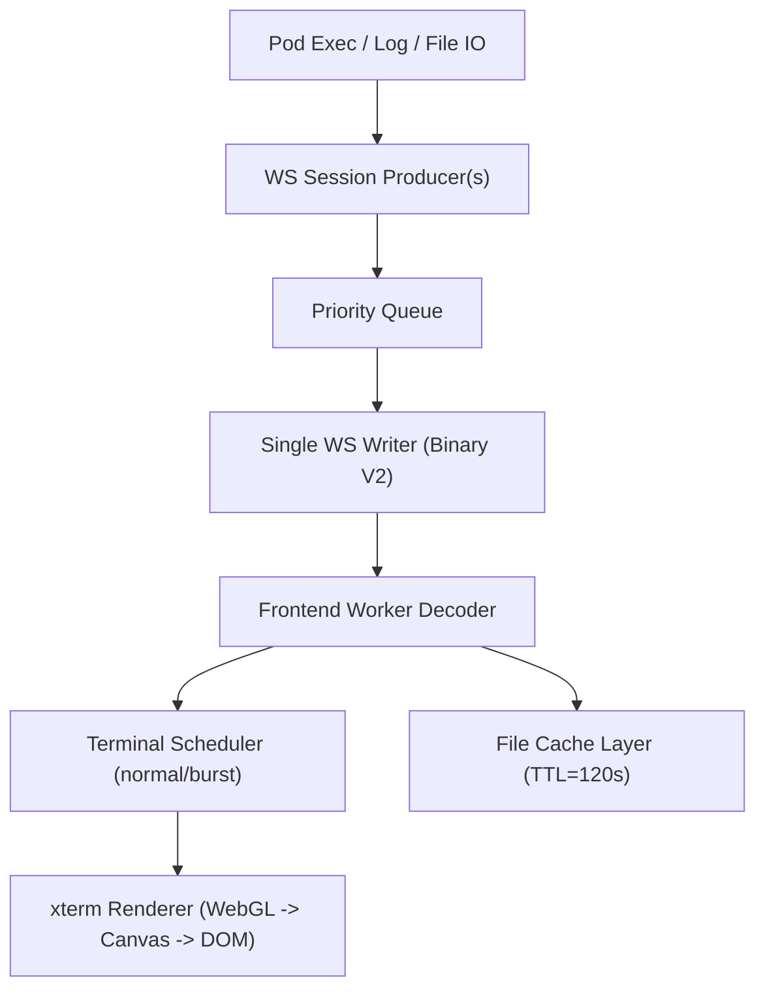

# 技术设计: 全链路极限丝滑改造（Stream V2）

## 技术方案

### 核心技术
- WebSocket Binary V2 帧协议（统一终端/日志/文件事件）
- 后端单写协程 + 多生产者优先级队列
- 前端 Worker 解帧 + xterm WebGL 优先渲染
- 文件预览缓存优先（TTL 120s）+ in-flight 去重

### 实现要点
- 统一定义 Binary V2 帧结构：`version | type | flags | requestId/sessionId/meta/payload lengths | body`
- 将终端输出、日志分块、文件响应统一通过二进制帧传输，降低 JSON 解析和大对象分配开销
- 输出调度采用 normal/burst 双模式（normal 24KB、burst 64KB、阈值 128KB、队列上限 1MB）
- 高压场景允许丢弃最旧 terminal/log 输出，并以 `dropped` 标记回传前端
- 文件读取先命中缓存再后台刷新，同路径并发请求合并

## 架构设计


## 架构决策 ADR
### ADR-20260423-01: 统一二进制协议并直接替换旧 JSON 协议
**上下文:** 现有 JSON 事件链路在高压输出场景存在解析与调度瓶颈，持续输出时交互丝滑度不足。  
**决策:** 终端/日志/文件统一升级到 Binary V2，不保留旧协议 fallback。  
**理由:** 直接减少序列化/反序列化成本与消息体积，避免双栈维护复杂度，缩短性能优化路径。  
**替代方案:** 双栈灰度迁移 → 拒绝原因: 研发复杂度与维护成本高，不符合“极限丝滑优先、直接替换”决策。  
**影响:** 客户端必须同步升级；旧客户端无法兼容。

### ADR-20260423-02: 高压输出采用“丝滑优先”策略
**上下文:** 持续刷屏时完全保序保全会导致前端积压，输入与滚动出现明显卡顿。  
**决策:** terminal/log 队列超限时丢弃最旧块，并保留用户可见提示。  
**理由:** 优先保证交互实时性，符合验收目标 `p95 < 30ms`。  
**替代方案:** 完整保留输出 → 拒绝原因: 在高压场景下无法稳定满足极限流畅度指标。  
**影响:** 历史输出可能局部缺失，但交互体验稳定。

## API设计
### WebSocket Binary V2（统一通道）
- **请求:** C2S 固定 `type code`（auth/open/input/resize/close/log/file）
- **响应:** S2C 固定 `type code`（ready/opened/output/closed/result/error）
- **flags:** `utf8Payload`、`binaryPayload`、`truncated`、`dropped`

## 数据模型
```sql
-- 前端内存缓存结构（逻辑模型）
-- key: absolute_path
-- value: {
--   content: string,
--   fetched_at_ms: number,
--   stale: boolean
-- }
```

## 安全与性能
- **安全:** 协议层保留鉴权校验与非法帧拒绝；文件访问仍受工作目录边界控制；禁用敏感信息输出到前端日志。
- **性能:** 后端分级队列 + 单写协程；终端 chunk 聚合参数基准 `16KB/4ms`，日志基准 `8KB/12ms`；前端 Worker 解码避免主线程阻塞。

## 测试与部署
- **测试:** 协议编解码测试、终端高压输出压测、标签切换回归、文件缓存命中与并发去重测试。
- **部署:** 前后端同步升级；上线前执行固定压测脚本并验证指标达标后再合并。

