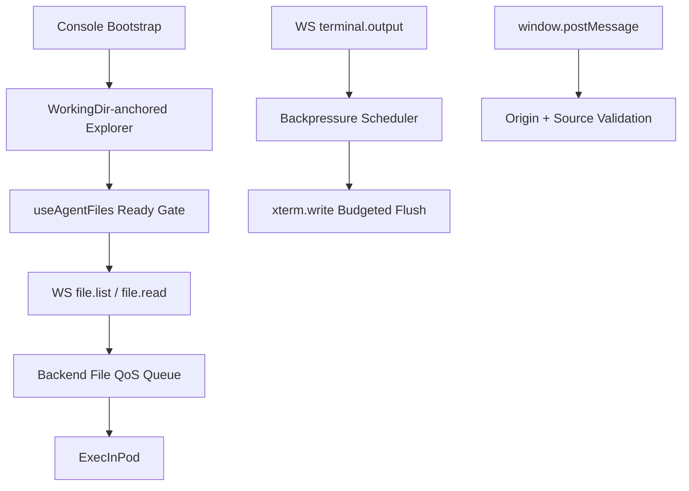

# 技术设计: 控制台深层性能与稳定性治理（文件链路 + 终端渲染）

## 技术方案

### 核心技术
- React 状态机收敛（effect 触发边界与一次性引导标记）
- WebSocket 事件驱动就绪门控（替代前端轮询等待）
- 后端文件操作 QoS（队列、超时、错误分类、请求去重协同）
- 终端输出背压 + 分级调度（normal/burst，持续输出下保持交互实时性）
- 安全收口（`postMessage` 来源校验）

### 实现要点
- 资源树根视角从“固定 `/` + 级联预加载”调整为“工作目录优先锚定 + 可跳转其他目录”。
- `useAgentFiles` 去掉 `waitForSocketReady` 轮询，改为 socket 生命周期事件驱动的 ready gate（Promise/Deferred）。
- 后端 `session.execCapture` 的文件操作队列与超时策略按操作类型分级，降低 `list/read` 互相阻塞。
- `terminalOutputScheduler` 保证队列上限不被告警追加突破，并减少 burst 模式下主线程饥饿。
- 控制台页面 effect 链路增加“用户手动折叠优先”约束，避免自动展开反复覆盖。

## 架构设计


## 架构决策 ADR
### ADR-20260424-01: 目录树默认锚定工作目录而非固定 `/`
**上下文:** 固定 `/` 的预加载会放大远端目录扫描成本，并影响首次可用速度。  
**决策:** 默认展开策略以 `defaultWorkingPath` 为主根视角，保留用户跳转 `/` 与其他路径。  
**理由:** 直接减少首次目录 IO，优先满足“开箱可用速度”。  
**替代方案:** 保持固定 `/` 并仅做缓存调参 → 拒绝原因: 不能从源头减少不必要目录扫描。  
**影响:** 目录树初始化逻辑与路径显示需要同步调整。

### ADR-20260424-02: 文件请求改为事件驱动就绪门控
**上下文:** 现有轮询等待 socket ready（80ms 轮询）会引入无效延迟并放大状态抖动。  
**决策:** 使用连接事件驱动（open/system.ready/error/close）维护 ready gate，`sendRequest` 仅 await gate。  
**理由:** 降低请求前等待开销，减少“看似空转”的慢感。  
**替代方案:** 延续轮询 + 缩短间隔 → 拒绝原因: 本质仍是 busy wait。  
**影响:** 需统一管理 pending request 生命周期与失败语义。

### ADR-20260424-03: 终端调度继续“丝滑优先”，但加强预算控制
**上下文:** 持续输出场景下，burst + immediate 调度可能造成主线程瞬时占用偏高。  
**决策:** 保留背压策略，增加 flush 预算与更稳态的调度切换，避免连续 `setTimeout(0)` 抢占。  
**理由:** 在不回退现有体验的前提下提升持续稳定性。  
**替代方案:** 完全暂停隐藏页或强制降频到极低 → 拒绝原因: 会破坏会话连续性与实时反馈。  
**影响:** 需要压测校准参数并补充边界测试。

## API设计
### 现有 WS 消息语义收敛（兼容优先）
- **请求:** 继续使用 `file.list` / `file.read` / `terminal.*`。
- **响应:** 保持 `file.result` / `terminal.output` / `error` 结构。
- **优化点:**
  - 错误分类标准化（区分连接未就绪、队列拥塞、执行超时）。
  - 在不破坏前端兼容的前提下附加可观测字段（如 queue wait / timeout type）。

## 数据模型
```sql
-- 前端内存态（逻辑模型）
-- directory_cache[path] = { items, fetched_at_ms }
-- file_cache[path]      = { content, fetched_at_ms, from_cache, stale }
-- ready_gate            = { state: connecting|ready|error|closed, resolve/reject lifecycle }
```

## 安全与性能
- **安全:**
  - `window.message` 校验 `event.origin` 与可信来源白名单。
  - 保持文件路径边界限制，不扩大可访问范围。
- **性能:**
  - 减少首次无效目录扫描与无效 ready 轮询。
  - 稳定终端 flush 节奏，避免高压输出引发 UI 抖动。
  - 后端文件操作队列按优先级/类型治理，减少请求堆积。

## 测试与部署
- **测试:**
  - 前端：目录默认展开/手动折叠行为测试，文件 ready gate 与重连测试，终端调度边界测试。
  - 后端：文件操作队列与超时回归测试（含高并发 list/read）。
- **部署:**
  - 先灰度至开发环境进行压测验证，再合并主分支。
  - 以“目录打开耗时、文件打开耗时、终端输入延迟、deadline 错误率”作为验收指标。

## 附录：perf smoke 基线（2026-04-24）
- 采集命令：`cd web && bun run perf:agent-console-smoke`
- 样本结果：
  - 资源树自动展开链路：`sample=3000`，`avg=0.186us`，`p95=0.25us`
  - 文件 ready gate 唤醒：`sample=400`，`avg=6684.52us`，`p95=9036.666us`
  - 终端背压写入：`sample=3000`，`avg=0.478us`，`p95=1.542us`
  - 重连策略：`maxReconnectAttempts=6`，`delay=[500,1000,2000,4000,8000]ms`
